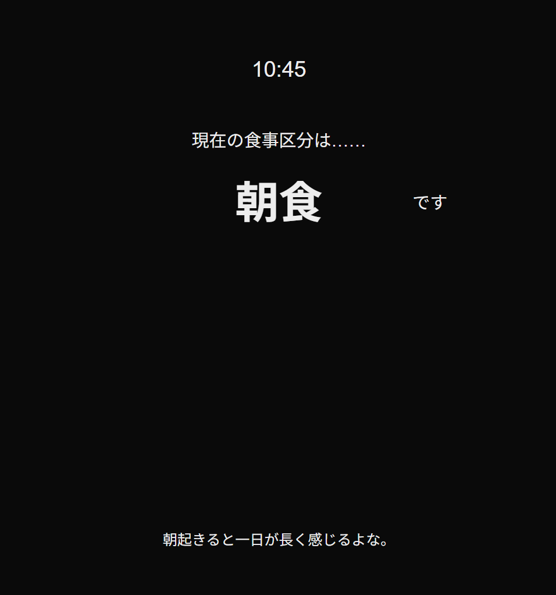

# CURRENT MEAL

現在の時間を参照して現在の食事の区分を伝えるアプリ（Next.js）

## 概要
その時々の食事区分（朝食、昼食、夕食、夜食）を明らかにするためのWebアプリです
学習目的でNext.jsを用いて開発し、vercelにデプロイしました。

## デモ / スクリーンショット
https://current-meal.vercel.app/



## 機能
- リアルタイムな時間の表示
- 時間に応じた食事区分の表示
- 各食事区分におけるランダムなひとことコメントの表示

## セットアップ
```## セットアップ

```bash
git clone https://github.com/iWaganer/current_meal
cd client
npm install
npm run dev
```

## 今後の予定
- 食事区分時間をまたぐ際のリアルタイム食事区分更新
- ランダムコメントの追加